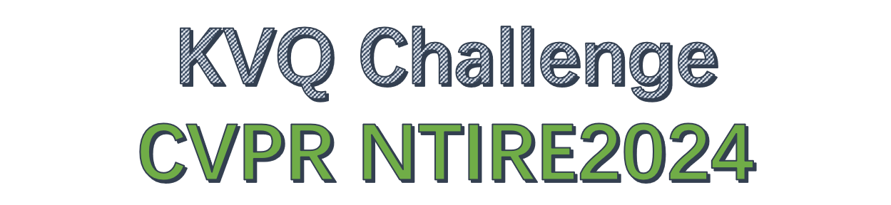

<p align="center">
  
</p>

# KVQ: Kaleidoscope Video Quality Assessment for Short-form Videos

[](https://arxiv.org/pdf/2402.07220.pdf)  [](https://lixinustc.github.io/projects/KVQ/) [](https://drive.google.com/drive/folders/1dkC4NsxMrd6Rxm1IogKe71U8bYy76ojV?usp=sharing)
[](https://codalab.lisn.upsaclay.fr/competitions/17638) 

## :bookmark: News!!!
- [x] 2024-03-03: **Upload an example for KVQ competition based on <a href="https://github.com/sunwei925/SimpleVQA">SimpleVQA</a> in this GitHub.**
- [x] 2024-03-26: **Upload the validation metric for competition named "metric_score.py" and release the quality label for the validation dataset in [link](https://drive.google.com/drive/folders/1UXwNDJsiYxgrVScQp8sN31ltT7B6LcW-?usp=drive_link).**
- [x] 2024-03-26: **We open the submission for the testing dataset in [Codalab](https://codalab.lisn.upsaclay.fr/competitions/17638), you can continue to validate your methods by submitting the results.** 
- [ ] 2024-03-30: **The KSVQE of our work will be released after the test phase of the competition.**

## 📌 Dataset for KVQ 
<p align="center">
  
</p>


##  :tada: Challenge Description

Short-form UGC videos, like Kwai and TikTok, have become a popular and irreplaceable mainstream media form, thriving on user-friendly engagement, and kaleidoscope creation, etc. However, the advancing content generation modes, e.g., special effects, and sophisticated processing workflows, e.g., de-artifacts, have introduced significant challenges to recent UGC video quality assessment (VQA).

To promote the development of short-form UGC VQA, we have the first NTIRE challenge on Short-form UGC Video Quality Assessment, jointly with the NTIRE workshop. This competition introduces the large-scale Kaleidoscope short Video database for Quality assessment, termed KVQ, for training and evaluation. The KVQ database compromises 600 user-uploaded short videos and 3600 processed videos through the diverse practical processing workflows. Moreover, it contains nine primary content scenarios in the practical short-form video platform, including landscape, crowd, person, food, portrait, computer graphic (termed as CG), caption, and stage, covering almost all existing creation modes and scenarios, and the ratio of each category of content satisfies the practical online statistics. The quality score of each short-form video and the partial ranked score are annotated with professional researchers on image processing.

The goal of this competition is to establish a new and applicable benchmark for short-form User Generated Content (UGC) quality assessment. We are looking forward to the collaborative efforts of our participants, aiming to elevate the quality of short-form video content. This competition will introduce an innovative evaluation methodology that incorporates a coarse-grained quality score measurement, along with fine-grained rankings for more challenging samples.

## :sparkles: Getting Start

### Prepare environment
```bash
conda create -n KVQ python=3.8
conda activate KVQ
pip install -r requirements.txt
```

Our codes are compatible with pytorch1.9.0, you may try newer version.

### Prepare training dataset
Download KVQ dataset from codalab competition [this link] (https://codalab.lisn.upsaclay.fr/)
Please add the path of KVQ and annotation to the items of "data_prefix" and "anno_file" in the config file (i.e. /config/kwai_simpleVQA.yml)

### prepare Slowfast feature 
```bash
python SlowFast_features.py --gpu_ids 0,1 --video_root yout_path  --video_csv yout_path
```
Please add the path of Slowfast feature to the items of "data_prefix_3D"  in the config file (i.e. /config/kwai_simpleVQA.yml)

### Train 
```bash
nohup python -u train.py  --o config/kwai_simpleVQA.yml --gpu_id 0,1 > log/kwai_simpleVQA.log 2>&1 &
```
or 
```bash
bash scripts/train.sh
```
### Test
```bash
nohup python -u test.py  --o config/kwai_simpleVQA_test.yml --gpu_id 0 > log/kwai_simpleVQA_test.log 2>&1 &
```
or 
```bash
bash scripts/test.sh
```

## Cite US
Please cite us if this work is helpful to you.
```
@inproceedings{lu2024kvq,
  title={KVQ: Kaleidoscope Video Quality Assessment for Short-form Videos},
  author={Lu, Yiting and Li, Xin and Pei, Yajing and Yuan, Kun and Xie, Qizhi and Qu, Yunpeng and Sun, Ming and Zhou, Chao and Chen, Zhibo},
  booktitle={Proceedings of the IEEE/CVF Conference on Computer Vision and Pattern Recognition},
  year={2024}
}
```

## Acknowledgments
The basic code is partially from the below repos.
- [SimpleVQA](https://github.com/sunwei925/SimpleVQA)
- [Dover](https://github.com/VQAssessment/DOVER)


